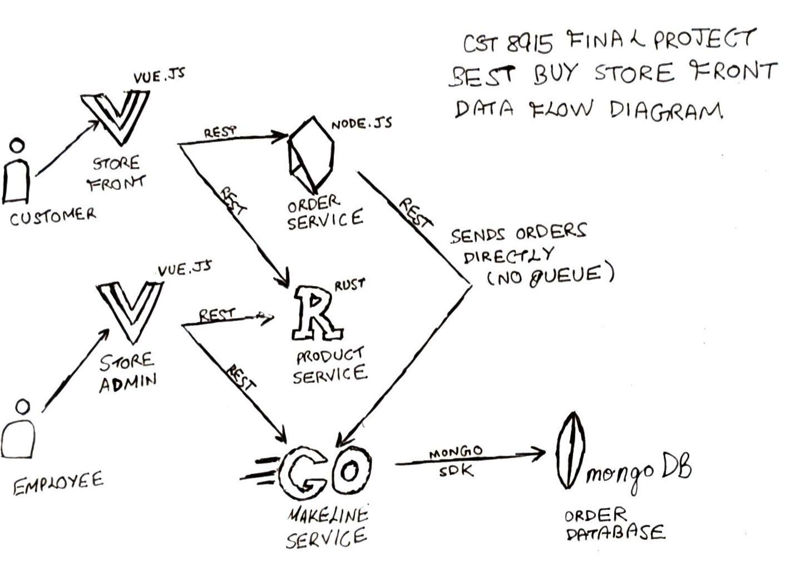

# CST8915 Final Project: Best Buy on Kubernetes

**Student Name**: Anoop Sidhu
**Student ID**: 040984994
**Course**: CST8915 Full-stack Cloud-native Development
**Semester**: Winter 2026

---
## Demo Video

🎥 [Watch Demo Video]()

---

## Architecture Diagram



---
## Application Explanation

- The application consists of 5 microservices and a database
- Store-Front: Customer-facing web app where users browse products, place orders, and track order status.
- Store-Admin: Employee-facing web app used to manage catalog content, pricing, and internal order operations.
- Order-Service: Backend API responsible for creating orders, validating order data, and coordinating order lifecycle events.
- Product-Service: Backend API that exposes product catalog data and supports product create/read/update operations.
- Makeline-Service: Background worker that consumes order events and performs asynchronous processing in the fulfillment pipeline.
- Database: MongoDB (Stateful) used as persistent storage for product and order data across the microservices.

---
## Deploy to Azure Kubernetes Service (AKS)

These steps deploy this project to a new AKS cluster using the manifests in this repository.

### 1) Prerequisites

- Azure subscription with permission to create resource groups and AKS clusters
- `az` (Azure CLI), `kubectl`, and `git` installed locally
- Docker images must be available in Docker Hub (this repo currently references `ansid0cker/*` images)

### 2) Sign in and set Azure subscription

```bash
az login
az account set --subscription "<YOUR_SUBSCRIPTION_NAME_OR_ID>"
az account show --output table
```

### 3) Create resource group and AKS cluster

```bash
# Set your values
RESOURCE_GROUP="rg-bestbuy-aks"
LOCATION="canadacentral"
AKS_NAME="aks-bestbuy"

az group create --name "$RESOURCE_GROUP" --location "$LOCATION"

az aks create \
	--resource-group "$RESOURCE_GROUP" \
	--name "$AKS_NAME" \
	--node-count 2 \
	--node-vm-size Standard_B2s \
	--generate-ssh-keys
```

### 4) Connect `kubectl` to your AKS cluster

```bash
az aks get-credentials --resource-group "$RESOURCE_GROUP" --name "$AKS_NAME" --overwrite-existing
kubectl get nodes
```

### 5) Create a namespace for the app

```bash
kubectl create namespace bestbuy
kubectl config set-context --current --namespace=bestbuy
```

### 6) Validate manifests before deploy

```bash
kubectl apply --dry-run=client -f "Deployment Files/" -R
```

If validation fails for a manifest, fix that file and re-run the dry run before continuing.

### 7) Deploy all manifests

```bash
kubectl apply -f "Deployment Files/statefulsets/"
kubectl apply -f "Deployment Files/deployments/"
kubectl apply -f "Deployment Files/services/"
```

### 8) Verify workloads

```bash
kubectl get pods -o wide
kubectl get deployments
kubectl get statefulsets
kubectl describe pod <POD_NAME>
kubectl logs <POD_NAME>
```

### 9) Access the application

The `Deployment Files/services/` directory includes `LoadBalancer` services for the store-front and store-admin deployments. Monitor their external IPs:

```bash
kubectl get svc -w
```

Wait for `EXTERNAL-IP` to be assigned, then navigate to those IPs in your browser to access the frontend and admin panel.

### 10) Clean up Azure resources

```bash
az group delete --name "$RESOURCE_GROUP" --yes --no-wait
```

---
Links

